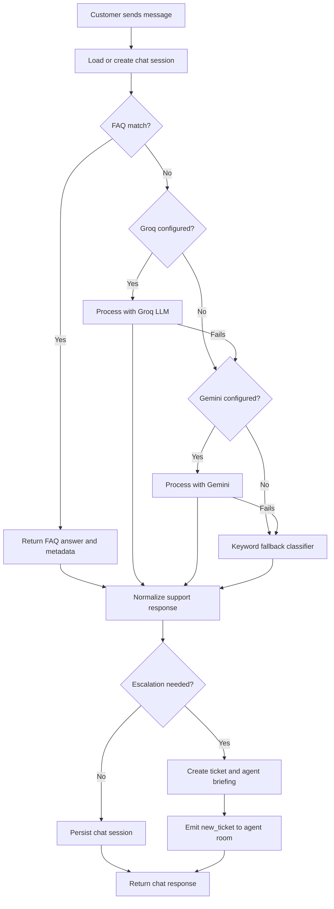
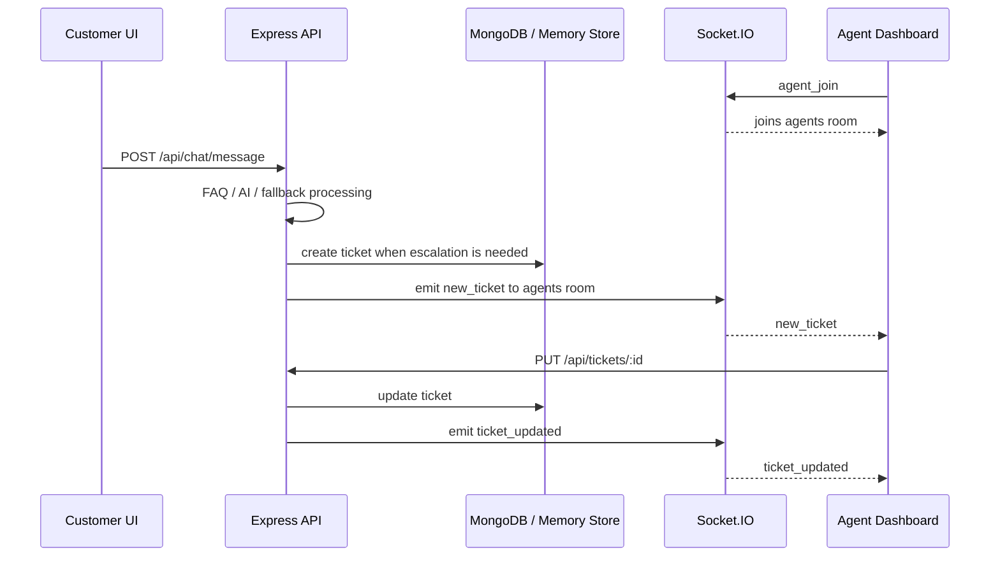
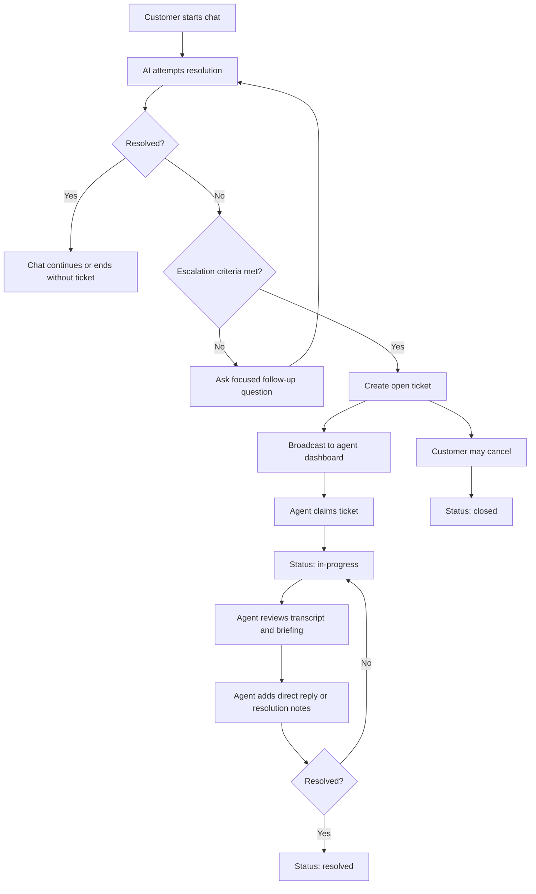
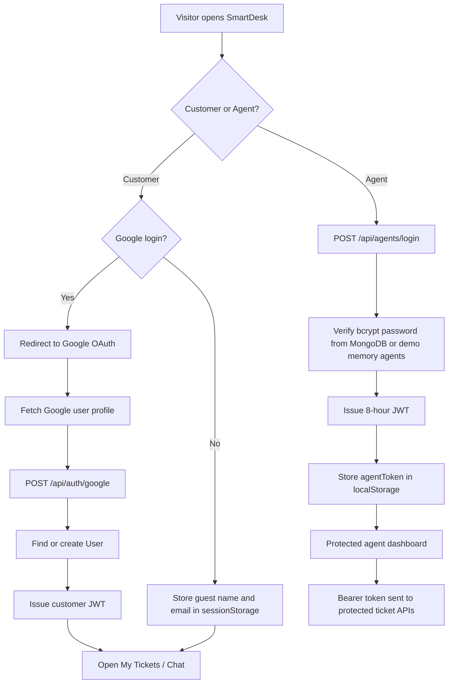
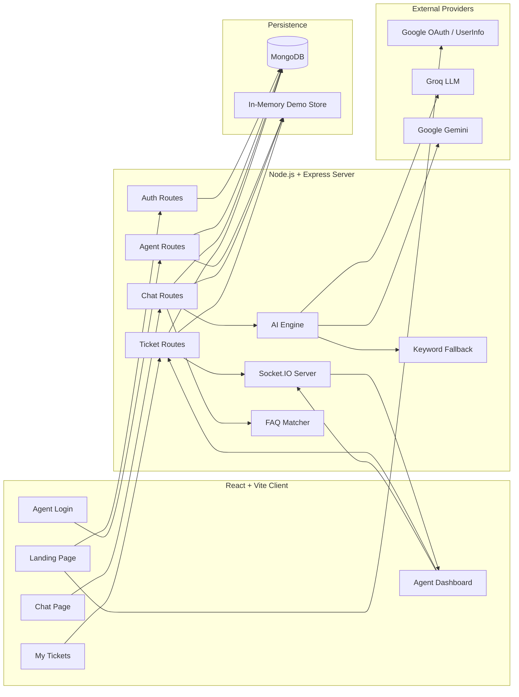

<div align="center">

# SmartDesk

### AI-Powered Complaint Management and Support Ticket Platform

SmartDesk is a full-stack support portal that combines an AI-first customer chat experience, automatic ticket escalation, severity classification, security-risk detection, and a real-time agent dashboard.

[](https://react.dev/)
[](https://expressjs.com/)
[](https://www.mongodb.com/)
[](https://socket.io/)
[](#ai-workflow)

</div>

---

## Overview

SmartDesk is designed for customer support teams that need to reduce repetitive manual triage while still giving users a clear escalation path to human agents. Customers can sign in with Google or continue as a guest, start a support conversation, receive instant AI-guided help, and automatically create a ticket when the issue needs human intervention.

Agents sign in through a separate dashboard where they can view, filter, claim, update, and export tickets. New tickets and ticket updates are broadcast to connected agent dashboards through Socket.IO when the Node server is running locally.

## Problem Statement

Support teams spend significant time handling repeated Level-1 questions, sorting complaints, identifying urgency, and deciding which cases require human action. This slows response time for important issues and creates inconsistent handoffs between the chatbot and human agents.

SmartDesk addresses this by making the AI assistant the first support touchpoint, while still preserving structured escalation, ticket history, agent briefing, severity scoring, and dashboard visibility.

## Solution Overview

SmartDesk provides:

| Capability | Implementation |
| --- | --- |
| Customer support entry point | Landing page with Google OAuth redirect flow and guest sign-in |
| AI support chat | HTTP chat endpoint with FAQ matching, LLM processing, and fallback classification |
| Ticket escalation | Automatic ticket creation based on unresolved issues, high severity, repeated messages, manual escalation, or security flags |
| Agent workspace | Protected dashboard with ticket cards, filters, analytics, modal details, status workflow, and exports |
| Real-time updates | Socket.IO rooms for agent dashboards and direct agent-to-user messages |
| Persistence | MongoDB with Mongoose models; in-memory fallback for demo/reduced functionality |

## Key Features

### Customer Experience

- Landing page with SmartDesk branding and light/dark theme toggle.
- Google sign-in using OAuth access token and Google user profile lookup.
- Guest support flow using name and email stored in `sessionStorage`.
- My Tickets page for customers to review ticket status by email.
- Ticket cancellation for customer-owned tickets that are not already resolved or closed.
- Chat reset and session clearing through the backend.

### AI Chatbot

- FAQ-first matching for common questions such as password reset, refund status, order tracking, profile updates, pricing, subscription cancellation, app crashes, payment failures, and human-agent requests.
- Groq-powered primary LLM classification when `GROQ_API_KEY` is configured.
- Gemini fallback when `GEMINI_API_KEY` is configured.
- Keyword classifier fallback when LLM providers are unavailable or fail.
- Suggested reply pills returned by the AI response.
- Sentiment score and visible emotion indicator in the chat UI.
- Manual escalation through the **Talk to Human** action.

### Ticket Management

- Automatic ticket IDs such as `TKT-...` for MongoDB tickets and `TKT-MEM-...` for in-memory demo tickets.
- Ticket metadata includes category, severity, emotion, urgency, security flag, summary, transcript, assigned agent, resolution notes, and AI agent briefing.
- Supported ticket statuses: `open`, `in-progress`, `resolved`, and `closed`.
- Customer ticket list with status filters and local ticket cache.
- Agent ticket list sorted by security flag, severity, and creation time.

### Agent Dashboard

- JWT-protected agent login.
- Dashboard cards for open, in-progress, resolved, high-priority, and security-flagged tickets.
- Status and severity filters.
- Optional analytics section with Recharts pie and bar charts.
- Ticket modal with customer details, AI summary, AI briefing, transcript, status workflow, direct reply box, and resolution notes.
- Claim workflow that assigns the current agent and moves a ticket to `in-progress`.
- Export support for CSV, PDF, and Excel files.

## AI Workflow

SmartDesk uses a layered AI workflow:

1. The customer submits a message through the chat UI.
2. The backend loads or creates the customer's chat session.
3. The message is checked against the local FAQ knowledge base.
4. If no FAQ match is found, Groq is attempted first using `llama-3.3-70b-versatile`.
5. If Groq fails or is unavailable, Gemini is attempted using `gemini-1.5-flash`.
6. If both LLM providers are unavailable, the keyword fallback classifier is used.
7. The response is normalized to include empathy, likely cause, and practical next steps.
8. If escalation criteria are met, a ticket is created with transcript and AI metadata.
9. A separate AI-generated agent briefing is attempted for escalated tickets.
10. Connected agent dashboards receive `new_ticket` events when Socket.IO is active.



## Severity Scoring System

Severity is produced by the LLM response schema or the fallback classifier.

| Severity | When it is used |
| --- | --- |
| `Low` | Informational or simple issues that can be answered directly. |
| `Medium` | Normal unresolved issues or manual human-agent requests from low-risk conversations. |
| `High` | Blocked access, repeated failures, strong frustration, urgent wording, or same-day business impact. |
| `Critical` | Account compromise, data exposure, fraud risk, active money loss, security attacks, or legal/threatening language. |

Fallback severity logic checks for:

- Billing, technical, and account keywords.
- Security-related keywords such as `admin`, `root`, `hack`, `exploit`, `bypass`, `sudo`, `sql`, `drop table`, `social engineering`, and `phishing`.
- Angry or desperate language.
- More than 50% uppercase letters in the message.
- Multiple exclamation marks as an urgency signal.

## Emotion Detection System

Ticket emotion is stored as one of:

| Emotion | Signals |
| --- | --- |
| `Calm` | Neutral or routine support requests. |
| `Frustrated` | Words such as `frustrated`, `annoying`, `unacceptable`, `ugh`, or `come on`. |
| `Angry` | Strong negative language, insults, profanity, or heavy uppercase usage. |
| `Desperate` | Urgent help requests such as `please help`, `urgent`, `emergency`, `asap`, or `right now`. |
| `Threatening` | Legal, public complaint, or threat language such as `lawsuit`, `lawyer`, `sue`, or `court`. |

The chat UI displays the current emotion and a sentiment meter based on the AI or fallback response.

## Security Threat Detection

SmartDesk flags security-risk conversations through both the LLM classification rules and fallback keyword detection. When a security signal is detected:

- `category` is set to `Security`.
- `securityFlag` is set to `true`.
- `severity` becomes `Critical`.
- `urgency` becomes `Immediate`.
- The ticket is prioritized in the agent dashboard sorting.
- The ticket card and modal display a security flag.

This is implemented for signals such as suspicious access requests, phishing, bypass attempts, exploit language, SQL-related attack terms, and unauthorized privilege requests.

## Real-Time Ticket Workflow

The backend includes a Socket.IO server in `server/server.js` and Socket.IO handlers in `server/socket/chatHandler.js`.

Implemented Socket.IO events include:

| Event | Direction | Purpose |
| --- | --- | --- |
| `agent_join` | Agent client to server | Joins the dashboard room named `agents`. |
| `new_ticket` | Server to agents | Broadcasts newly escalated tickets. |
| `ticket_updated` | Server to agents | Broadcasts status, assignment, transcript, or note updates. |
| `agent_direct_message` | Agent client to server | Sends a direct agent reply to a user's room and appends it to the transcript/session. |
| `user_join` | User client to server | Legacy/socket chat path for joining a personal user room. |
| `user_message` / `send_message` | User client to server | Legacy/socket chat path for AI processing. |
| `bot_message` | Server to user | Sends AI or agent messages to the user socket. |
| `ticket_created` | Server to user | Notifies the user socket when a ticket is created. |

The current React chat page uses the HTTP chat endpoint (`/api/chat/message`). The agent dashboard uses Socket.IO for live ticket updates.



## Ticket Lifecycle



## Authentication and Authorization Flow

SmartDesk has two authentication paths:

| User type | Flow |
| --- | --- |
| Customer | Google OAuth redirect or guest name/email entry. Customer identity is stored in `sessionStorage` for the frontend flow. Google users receive a backend JWT stored in `sessionStorage` as `token`. |
| Agent | Email/password login through `/api/agents/login`. Passwords are compared with bcrypt hashes. A JWT is stored in `localStorage` as `agentToken`. Protected agent API calls use `Authorization: Bearer <token>`. |



## System Architecture



## Detailed Tech Stack

| Layer | Technology |
| --- | --- |
| Frontend framework | React 19 with Vite |
| Routing | React Router DOM 7 |
| Styling | CSS Modules and global CSS |
| Charts | Recharts |
| HTTP client | Axios and Fetch |
| Real-time client | Socket.IO Client |
| Export libraries | jsPDF, jspdf-autotable, xlsx |
| OAuth client | `@react-oauth/google` plus manual Google OAuth redirect handling |
| Backend runtime | Node.js |
| API framework | Express 5 |
| Real-time server | Socket.IO |
| Database | MongoDB |
| ODM | Mongoose |
| Authentication | JWT and bcryptjs |
| Google token/profile support | google-auth-library and Google UserInfo API |
| Primary AI provider | Groq SDK with `llama-3.3-70b-versatile` |
| Fallback AI provider | Google Gemini with `gemini-1.5-flash` |
| Offline fallback | Local keyword classifier |
| Deployment config | Separate Vercel configs for `client` and `server` |

## API Overview

<details open>
<summary><strong>Public and Customer APIs</strong></summary>

| Method | Endpoint | Auth | Description |
| --- | --- | --- | --- |
| `GET` | `/` | No | API status with selected AI provider and database connection state. |
| `GET` | `/api/health` | No | Health response with provider and database status. |
| `POST` | `/api/auth/google` | No | Verifies Google profile/token, creates or finds a user, and returns a backend JWT. |
| `GET` | `/api/chat/session?email=<email>` | No | Loads chat session messages and initial suggestions. |
| `POST` | `/api/chat/message` | No | Processes a customer message, returns AI metadata, and may create a ticket. |
| `POST` | `/api/chat/session/clear` | No | Clears the chat session for an email. |
| `GET` | `/api/tickets/user/:email` | No | Lists tickets for a customer email. |
| `PUT` | `/api/tickets/user/:id/cancel` | Customer email in body | Closes a customer-owned ticket if it is not resolved or closed. |

</details>

<details open>
<summary><strong>Agent APIs</strong></summary>

| Method | Endpoint | Auth | Description |
| --- | --- | --- | --- |
| `POST` | `/api/agents/login` | No | Agent login with email/password. Returns an 8-hour JWT. |
| `GET` | `/api/tickets` | Agent JWT | Lists tickets with optional `status`, `severity`, `category`, `emotion`, and `urgency` filters. |
| `GET` | `/api/tickets/stats/overview` | Agent JWT | Returns dashboard counts. Implemented in backend, while the current dashboard computes stats client-side. |
| `GET` | `/api/tickets/suggestion/:id` | Agent JWT | Generates or returns suggested resolution guidance for a ticket. |
| `GET` | `/api/tickets/:id` | Agent JWT | Gets one ticket by Mongo `_id` or `ticketId`. |
| `PUT` | `/api/tickets/:id` | Agent JWT | Updates status, assigned agent, and resolution notes. |

</details>

## Environment Variables

### Backend: `server/.env`

| Variable | Required | Description |
| --- | --- | --- |
| `PORT` | No | Local backend port. Defaults to `5000`. |
| `MONGO_URI` | Recommended | MongoDB connection string. Without it, the server continues with reduced in-memory functionality. |
| `GROQ_API_KEY` | Optional | Enables the primary Groq LLM workflow. |
| `GEMINI_API_KEY` | Optional | Enables Gemini as an AI fallback provider. |
| `GOOGLE_CLIENT_ID` | Required for Google login | Google OAuth client ID used for token verification. |
| `JWT_SECRET` | Recommended | Secret for signing customer and agent JWTs. Fallback secrets exist for demos but should not be used in production. |

### Frontend: `client/.env`

| Variable | Required | Description |
| --- | --- | --- |
| `VITE_API_URL` | Yes | Backend API base URL, for example `http://localhost:5000`. |
| `VITE_GOOGLE_CLIENT_ID` | Required for Google login | Google OAuth client ID exposed to the frontend. |

## Setup and Installation

### Prerequisites

- Node.js 18 or newer
- npm
- MongoDB Atlas or a local MongoDB-compatible connection string
- Optional Groq and Gemini API keys for AI provider support
- Google OAuth client ID for Google sign-in

### 1. Clone the Repository

```bash
git clone <repository-url>
cd Chat-agent
```

### 2. Configure the Backend

```bash
cd server
npm install
copy .env.example .env
```

Update `server/.env` with your MongoDB URI, JWT secret, Google client ID, and optional AI keys.

Seed demo agents into MongoDB:

```bash
npm run seed
```

Start the local backend with Socket.IO:

```bash
npm run dev
```

The backend runs at `http://localhost:5000` by default.

### 3. Configure the Frontend

Open a second terminal:

```bash
cd client
npm install
copy .env.example .env
npm run dev
```

Open the Vite URL shown in the terminal, usually `http://localhost:5173`.

## Demo Credentials

These demo agents are available through the in-memory fallback and can also be seeded into MongoDB:

| Role | Email | Password |
| --- | --- | --- |
| Agent | `rakesh@smartdesk.dev` | `agent123` |
| Agent | `ujjwal@smartdesk.dev` | `agent123` |
| Agent | `adi@smartdesk.dev` | `agent123` |

The seed script also creates:

| Role | Email | Password |
| --- | --- | --- |
| Agent | `agent1@support.com` | `password123` |
| Agent | `agent2@support.com` | `password123` |

## Deployment Guide

The project includes separate Vercel configurations for the frontend and backend.

### Frontend Deployment

- Vercel root directory: `client`
- Build command: `npm run build`
- Output directory: `dist`
- Required environment variables:

```env
VITE_API_URL=https://your-backend-url
VITE_GOOGLE_CLIENT_ID=your_google_client_id.apps.googleusercontent.com
```

The frontend `vercel.json` rewrites all routes to `index.html` for React Router support.

### Backend Deployment

- Vercel root directory: `server`
- Entry point: `api/index.js`
- Required environment variables:

```env
MONGO_URI=your_mongodb_connection_string
JWT_SECRET=your_secure_jwt_secret
GOOGLE_CLIENT_ID=your_google_client_id.apps.googleusercontent.com
GROQ_API_KEY=your_groq_api_key
GEMINI_API_KEY=your_optional_gemini_key
```

Important note: `server/server.js` starts the HTTP server and Socket.IO for local development. The Vercel backend entry point exports the Express app from `server/api/index.js`, so HTTP APIs work in that deployment shape. For production-grade Socket.IO, deploy the backend on a long-running Node host that supports WebSockets, or keep realtime behavior local/development-only.

## Project Structure

```text
Chat-agent/
|-- .gitignore
|-- README.md
|-- client/
|   |-- .env.example
|   |-- .gitignore
|   |-- eslint.config.js
|   |-- index.html
|   |-- package-lock.json
|   |-- package.json
|   |-- vercel.json
|   |-- vite.config.js
|   |-- public/
|   |   |-- favicon.svg
|   |   `-- icons.svg
|   `-- src/
|       |-- App.css
|       |-- App.jsx
|       |-- index.css
|       |-- main.jsx
|       |-- api/
|       |   `-- axios.js
|       |-- assets/
|       |   |-- hero.png
|       |   |-- react.svg
|       |   `-- vite.svg
|       |-- components/
|       |   |-- Logo.jsx
|       |   |-- PageShell.jsx
|       |   |-- PageShell.module.css
|       |   |-- ProtectedRoute.jsx
|       |   |-- StatsPanel.jsx
|       |   |-- StatsPanel.module.css
|       |   |-- ThemeToggle.jsx
|       |   |-- ThemeToggle.module.css
|       |   |-- TicketCard.jsx
|       |   |-- TicketCard.module.css
|       |   |-- TicketModal.jsx
|       |   `-- TicketModal.module.css
|       |-- context/
|       |   |-- ThemeContext.jsx
|       |   `-- UserContext.jsx
|       `-- pages/
|           |-- AgentLogin.jsx
|           |-- AgentLogin.module.css
|           |-- ChatPage.jsx
|           |-- ChatPage.module.css
|           |-- Dashboard.jsx
|           |-- Dashboard.module.css
|           |-- LandingPage.jsx
|           |-- LandingPage.module.css
|           |-- MyTickets.jsx
|           `-- MyTickets.module.css
`-- server/
    |-- .env.example
    |-- .gitignore
    |-- app.js
    |-- package-lock.json
    |-- package.json
    |-- server.js
    |-- vercel.json
    |-- api/
    |   `-- index.js
    |-- config/
    |   `-- db.js
    |-- middleware/
    |   `-- auth.js
    |-- models/
    |   |-- Agent.js
    |   |-- ChatSession.js
    |   |-- Ticket.js
    |   `-- User.js
    |-- routes/
    |   |-- agentRoutes.js
    |   |-- authRoutes.js
    |   |-- chatRoutes.js
    |   `-- ticketRoutes.js
    |-- scripts/
    |   `-- seedAgents.js
    |-- services/
    |   |-- aiEngine.js
    |   |-- fallback.js
    |   |-- faqMatcher.js
    |   `-- memoryStore.js
    `-- socket/
        `-- chatHandler.js
```

## Screenshots

Add screenshots to this section after capturing the running app.

| Screen | Preview |
| --- | --- |
| Landing Page | `screenshots/landing-page.png` |
| Customer Chat | `screenshots/customer-chat.png` |
| My Tickets | `screenshots/my-tickets.png` |
| Agent Login | `screenshots/agent-login.png` |
| Agent Dashboard | `screenshots/agent-dashboard.png` |
| Ticket Modal | `screenshots/ticket-modal.png` |

## Future Improvements

- Use the existing `/api/tickets/suggestion/:id` endpoint directly in the ticket modal.
- Add persistent customer-to-agent realtime chat in the current HTTP-based chat page.
- Add role-based authorization beyond the current agent JWT check.
- Add password reset and account management for agents.
- Add automated tests for AI fallback classification, ticket escalation, and protected routes.
- Add production WebSocket hosting for realtime dashboard updates outside local Node runtime.
- Add notification channels such as email or SMS for ticket status changes.
- Add SLA timers and assignment queues for agent workload management.

## Contributors

| Name | Role |
| --- | --- |
| Team Spark | Project team |
| Add contributor name | Add role or contribution |

## License

This project is licensed under the ISC license as declared in `server/package.json`.

